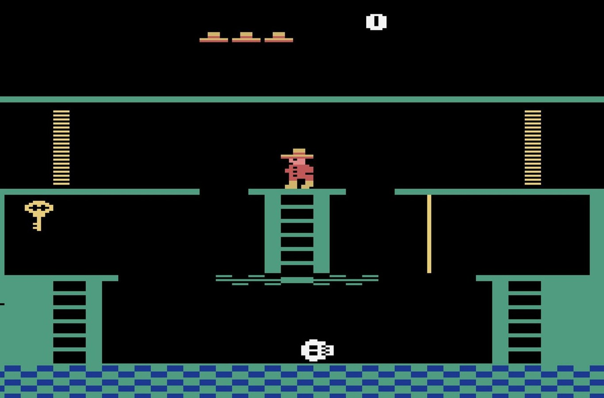
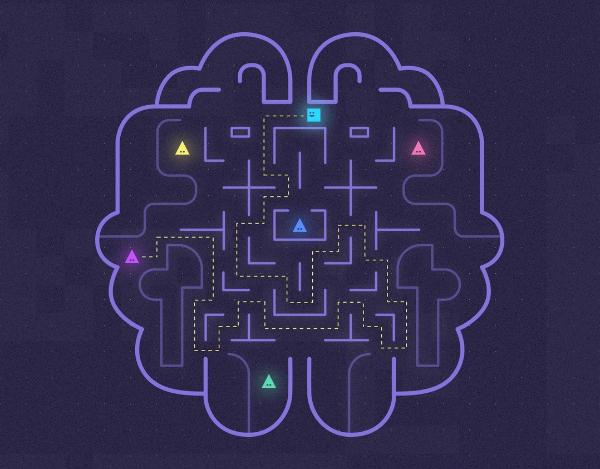

**DeepMind** ya ha dominado varios juegos de Atari. Para esto se ha necesitado 
programación especifica para cada juego. Ahora, gracias a un nuevo algoritmo 
desarrollado por Google, esta plataforma de inteligencia artificial es capaz 
de usar todo su conocimiento para aprender cómo jugar otro videojuego, sin la 
necesidad de tener nueva programación.

Desde que Google adquirió DeepMind en 2014 hemos sido testigos de varios 
avances dentro de esta plataforma de inteligencia artificial. 
Avances que van desde dominar al campeón mundial de Go, manipular 
objetos físicos, hasta jugar StarCraft II, e incluso la han "enseñado" 
a colaborar y competir con otro sistema de IA. Pero hoy estamos ante un nuevo hito, 
ya que DeepMind está estrenando la capacidad de tener "memoria".

Los responsables de DeepMind lograron el año pasado que el sistema fuera 
capaz de derrotar juegos de Atari, incluso superando las puntuaciones de 
los seres humanos, pero DeepMind no recuerda cómo lo hizo. Para cada juego 
se desarrollaba una red neuronal basada en la información de cómo jugar y 
cuál era el objetivo, es decir, una red neuronal entrenada para Space Invaders no era capaz de jugar Pac-Man.

La capacidad de aprender tareas de forma sucesiva y sin olvidarlas es 
una capacidad de la inteligencia biológica y artificial, sin embargo, 
la artificial ha sido incapaz de transferir ese aprendizaje a una nueva tarea. 
Pero ahora, gracias al EWC la red neuronal será capaz de retener los aspectos 
clave de su programación, para así aprender una nueva tarea por sí misma sin anular sus conocimientos previos.

[Fuente](https://www.xataka.com/robotica-e-ia/deepmind-la-inteligencia-artificial-de-google-ya-es-capaz-de-recordar-y-usar-lo-aprendido-en-nuevas-tareas "Fuente")
