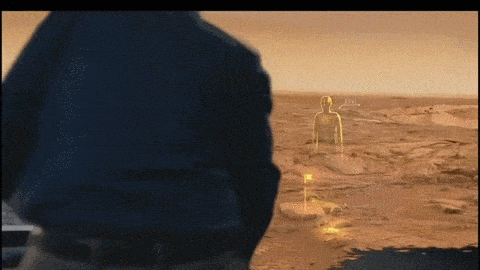
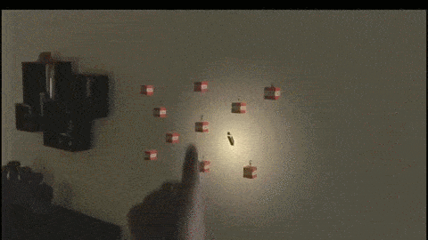
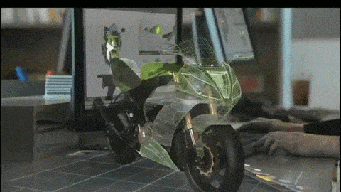
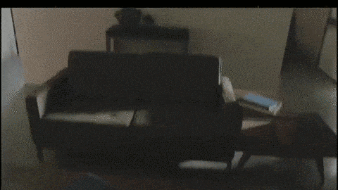

**Microsoft** sorprendió hace 2 años al mundo tecnológico en la presentación de 
Windows 10 con HoloLens, un casco de se sirve de hologramas para potenciar 
la interacción del usuario en experiencias de diversos ámbitos como tareas 
cotidianas, laborales y hasta videojuegos. La tecnología tiene previsto 
lanzarse en una fecha por definir dentro de la vida útil del nuevo sistema operativo, 
y aunque todavía es pronto para entrar en detalles sobre usos específicos, 
lo que se pudo ver en el tráiler es prometedor. Analizamos el tráiler para 
encontrar cinco usos de HoloLens que pueden hacer que jugar a videojuegos sea más atractivo.

## 5 Características de las Hololens.

**Integración del jugador en una aventura.** Lo que en la presentación se ha 
ejemplificado con la exploración espacial trasladada al salón de casa o 
la oficina de manera interactiva, en los videojuegos puede dar mucho de sí. 
Piensa en una aventura gráfica y en cómo tú mismo puedes ser el protagonista 
detectando pistas y resolviendo puzles sobre el escenario que es tu misma habitación. 
Holosens es capaz de cuadrar lo que verías en el televisor dentro de tu sala de juego 
y hacerte navegar por el territorio. Alguien debería hablar con Tim Schafer.

**Rompe barreras entre realidad y ficción.** Que la pared de tu casa te lleve 
a otro mundo solo tiene un inconveniente: el golpe que te puedes dar si pierdes 
la noción de la realidad. Piensa en un juego de la serie Portal donde los portales 
queden reflejados en tu propia habitación. No hace falta entrar en muchos detalles 
para hacerse a la idea. Incluso podrías contar con un asistente virtual en las partidas 
que te ayude a avanzar o que te ofrezca soporte, como el Claptrap de Borderlands o Cortana de Halo.
¿Será este el fin de las aplicaciones de compañía?

**Jugar sin televisor.** La tele es la pared, el frigorífico o la cama. 
Te pones el casco y tú decides dónde ves la acción. Lo que en el vídeo 
es un partido de fútbol en directo, en el mundo del videojuego se puede 
cambiar por una partida de Halo. Ideal para las vacaciones sin cargar con consolas. 
Y si además le añades compatibilidad con el nuevo sistema de streaming de 
Xbox One a dispositivos como tablets o PC, ganas un combo que te permitirá 
jugar fuera de casa cargando un solo aparato y con la máxima inmersión posible. 

**Explora elementos al detalle.** Si el diseño industrial de motos puede 
salir ganando con Holosens por aquello de no tener que gastar materiales 
reales para ver cómo queda un prototipo sometido a cambios, imagina las 
posibilidades para los videojuegos de conducción. Piensa en la experiencia 
de control de la saga Forza con Kinect y maximiza la inmersión colocando 
réplicas tridimensionales de sus coches en tu escritorio para modificar 
sus características en tiempo real y que queden reflejadas en el juego.

**Tu casa, un mundo de Minecraft.** La preferida de los niños y la razón por 
la que muchos padres estarán obligados a regalar Holosens 
-si su precio no es prohibitivo, claro-. Monta un mundo de Minecraft 
con los gestos en la mesa de tu salón, coloca y quita bloques, 
gestiona materiales, desarrolla tus creaciones a escala... Imagina 
que todos esos diseños espectaculares de otros mundos de juegos, series, 
películas y más quedan plasmados en tu salón para que los visites en primera persona. 
Toda una experiencia.

Por el momento no tenemos más noticias sobre las Hololens, ni el futuro que le depara
pero es un gran avance para la industria de los videojuegos.

[Fuente](http://www.meristation.com/noticias/hololens-cinco-usos-de-hologramas-en-videojuegos/2036261 "Fuente")
