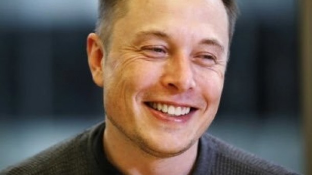
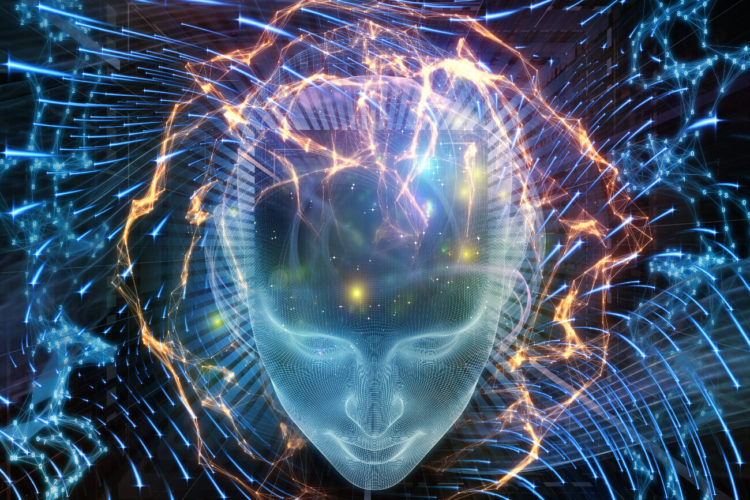
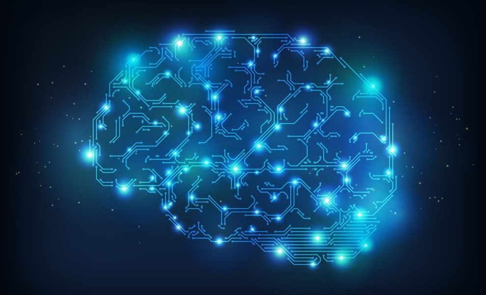

Elon Musk, el fundador de Tesla e Hyperloop entre otras compañías, 
ha creado Neuralink, una nueva empresa que tiene como objetivo desarrollar 
sistemas para implantar en el cerebro humano sistemas informáticos de Inteligencia Artificial, 
según ha publicado el diario estadounidense The Wall Street Journal.

La iniciativa de Musk aspira a que el cerebro humano pueda aprovecharse de las 
mejoras en sistemas informáticos para lograr beneficios en cuanto a la memoria 
o a la longevidad del funcionamiento de este órgano. Los primeros avances de 
la compañía estarán destinados a combatir enfermedades cerebrales crónicas como 
la epilepsia y las depresiones graves, según el citado medio.

La nueva 'startup' aspira a encontrar una forma de llevar a cabo lo que 
denominan 'conexiones neuronales' entre el cerebro y un ordenador. Por el 
momento no se sabe demasiado sobre su actividad y de cómo serán sus proyectos, 
y se desconoce si estos procesos podrían realizarse sin intervenciones quirúrgicas 
de por medio, algo que ya está estudiando Building 8, otra 'startup', en este caso de Facebook.

Neuralink no es el primer proyecto de innovación creado por Musk --tampoco se sabe si dirigirá la nueva empresa--. 
Además de Tesla, el empresario también posee SpaceX, la compañía de 
transporte aeroespacial que ofrece viajes en el espacio y que planea 
llegar a Marte a partir de 2022, según el propio Musk.

[Fuente](http://www.eitb.eus/es/noticias/tecnologia/detalle/4734745/elon-musk-funda-neuralink-fusionar-cerebro-ordenador/ "Fuente")
